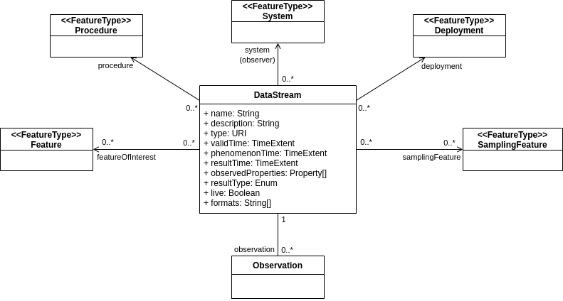
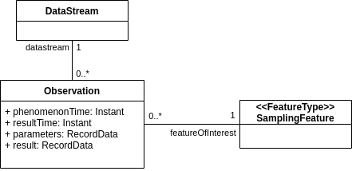

[[clause-datastream-resources]]
== Requirements Class "Datastreams & Observations"
include::requirements/datastreams/requirements_class_datastreams.adoc[]

=== Overview

This requirements class specifies how `DataStream` and `Observation` resource descriptions are provided using this API.

The `DataStream` resource represents a dataset that is produced by an (observation) system, that is itself represented by a `System` feature in the API.

A `DataStream` represents the real-time data stream coming out of the system as well as the historical data accumulated from such stream. It can be used to provide access to real-time data only, archived data only, or both. The time periods that are part of the `Datastream` resource description are used to disambiguate between these cases.

A `DataStream` also implements an _https://www.w3.org/TR/vocab-ssn-ext/#observation-collection[homogeneous collection of observations]_ as defined in <<OGC-W3C-SSN-EXT,Extensions to the SSN Ontology>>. Consequently, `Observation` resources are available through a sub-collection of a `DataStream` resource.

[NOTE]
The exact way properties and associations of the resources defined in this section are represented in the payload is defined by each encoding. See section <<clause-encoding-json>> for example representations of these resources.

=== Datastream Resources

This section defines the properties and associations (links to other resources) that apply to `DataStream` resources.

Below is the contextual class diagram of the `DataStream` resource:

[#datastream-class,reftext='{figure-caption} {counter:figure-num}']
.DataStream Resource Diagram

==== Properties

[[req_datastream-props]]
[width="90%",cols="2,6a",options="header"]
|===
^|*Requirement {counter:req-id}* |*/req/datastream/properties*
^| A | A `DataStream` resource SHALL include all mandatory properties listed in <<datastream-properties>>.
|===

[#datastream-properties,reftext='{table-caption} {counter:table-num}']
.Datastream Properties
[width="100%",cols="4,10,3,3",options="header"]
|====
| *Name*               | *Definition* | *Data Type* | *Usage*
| `name`               | The human readable name of the datastream. | String | Mandatory
| `description`        | A human readable description for the datastream. | String | Optional
| `type`               | The type of datastream (see <<datastream-types>>). | Enum | Optional
| `validTime`          | The validity period of the datastream's description. | TimeExtent | Optional
| `phenomenonTime`     | The time period spanned by the phenomenon times of all observations in this datastream. | TimeExtent | Mandatory
| `resultTime`         | The time period spanned by the result times of all observations in this datastream. | TimeExtent | Mandatory
| `observedProperties` | Properties for which the observations in this datastream provide measurements. | List<URI> | Mandatory
| `formats`            | The list of formats that the observations in this datastream can be encoded to. | List<String> | Mandatory
|====

[[req_datastream-type]]
[width="90%",cols="2,6a",options="header"]
|===
^|*Requirement {counter:req-id}* |*/req/datastream/type*
^| A | A `DataStream` resource encoding SHALL use one of the URIs provided in <<datastream-types>> as the value of the `Type` property.
       If using a URI is not practical, the encoding SHALL define a mapping between all possible values used to encode the type and the URIs defined in this table.
|===

[#datastream-types,reftext='{table-caption} {counter:table-num}']
.Datastream Types
[width="100%",cols="2,10",options="header"]
|====
| *Type*       | *Usage*
| System       | For datastreams providing status observations of the parent system itself or one of its subsystems.
| ExternalFOI  | For datastreams providing observations of other features of interest.
|====

==== Associations

A `DataStream` resource is also required to include the following associations:

[[req_datastream-links]]
[width="90%",cols="2,6a",options="header"]
|===
^|*Requirement {counter:req-id}* |*/req/datastream/links*
^| A | A `DataStream` resource SHALL include the associations defined in <<datastream-links>>.
|===

[#datastream-links,reftext='{table-caption} {counter:table-num}']
.Datastream Associations
[width="100%",cols="5,10,10",options="header"]
|====
| *Relation Name*     | *Definition* | *Target Content*
| `system`            | Link to the `System` that outputs this datastream. | A single `System` resource.
| `observations`      | Link to the `Observations` that are part of this datastream. | A collection of `Observation` resources.
| `samplingFeatures`  | Link to the `Sampling Features` that are the subject of observations in this datastream. | A collection of `SamplingFeature` resources.
| `ultimateFeaturesOfInterest`  | Link to the ultimate features of interest that are the subject of observations in this datastream. | A collection of `Feature` resources.
|====

=== Datastream Collections

Top level `Datastream` resource collections are identified with the item-type `'datastream'`.

[[req_datastream-collection]]
[width="90%",cols="2,6a",options="header"]
|===
^|*Requirement {counter:req-id}* |*/req/datastream/collection*
^|A |The server SHALL expose at least one collection containing `Datastream` resources.
|===

[[req_datastream-collection-type]]
[width="90%",cols="2,6a",options="header"]
|===
^|*Requirement {counter:req-id}* |*/req/datastream/collection-type*
^|A |The server SHALL identify all collections containing `DataStream` resources by setting the value of the `itemType` property to `'datastream'`.
|===

[[req_datastream-catchall-collection]]
[width="90%",cols="2,6a",options="header"]
|===
^|*Requirement {counter:req-id}* |*/req/datastream/catchall-collection*
^|A |The server SHALL expose a collection containing all available `DataStream` resources at URL `{api_root}/datastreams`.
|===

[[req_datastream-system-collection]]
[width="90%",cols="2,6a",options="header"]
|===
^|*Requirement {counter:req-id}* |*/req/datastream/system-collection*
^|A | The server SHALL expose the collection of all `DataStream` resources associated to a given `System` at URL `{systemResourceUrl}/datastreams`.
|===

=== Observation Schema Resources

Multiple observation formats can be offered for any given datastream. This API provides a way for the server to communicate the schema (_not necessarily a JSON schema_) corresponding to each observation format.

Note that, even for standard media types such as O&M JSON, a different schema is needed for each individual datastream because the exact content of the observations `result` property changes according to the properties being observed.

[[req_datastream-schemas]]
[width="90%",cols="2,6a",options="header"]
|===
^|*Requirement {counter:req-id}* |*/req/datastream/schema*
^| A | The server SHALL expose the schemas for a given `DataStream` at URL `{datastreamResourceUrl}/schema`.
^| B | The server SHALL return a single schema corresponding to the format identified by the mandatory `obsFormat` query parameter.
|===

.Example
=================
If a datastream reports the following supported observation formats:

- `application/json`
- `application/swe+csv`
- `application/swe+binary`

The schema for each of these formats is obtained with the following requests, respectively:

- `\https://{api_root}/datastreams/{id}/schema?obsFormat=application/json`
- `\https://{api_root}/datastreams/{id}/schema?obsFormat=application/swe%2Bcsv`
- `\https://{api_root}/datastreams/{id}/schema?obsFormat=application/swe%2Bbinary`

Note that the media type in the request has to be properly URL encoded, leading to the `%2B` in place of the `+` character.
=================

[NOTE]
The exact content of a schema resource is defined by each encoding. See section <<clause-encoding-json>> for example schemas used for observations encoded using the default JSON format.

=== Observation Resources

`Observation` resources are modeled on the corresponding _http://www.w3.org/ns/sosa/Observation[Observation]_ concept defined in the <<OGC-W3C-SSN,SSN Ontology>>.

However, since `Observation` resources exposed through the API are always part of a `Datastream` (e.g. a type of https://www.w3.org/TR/vocab-ssn-ext/#sosa:ObservationCollection[_ObservationCollection_]), they don't have to include all mandatory properties as most of them can be factored at the datastream level.

Thus, an `Observation` resource is not directly associated to a `Sensor` and a `Procedure`. Instead, it is the `Datastream` that the observation is part of, that is attached to a parent `System`. And it is the `System` that is, in turn, associated to the `Procedure` that it implements. 

In addition, `Observation` resources are not restricted to a single observed property. It is thus possible to package the observation result of several properties in a single resource.

Below is the contextual class diagram of the `Observation` resource:

[#observation-class,reftext='{figure-caption} {counter:figure-num}']
.Observation Resource Diagram

==== Properties

[[req_observation-props]]
[width="90%",cols="2,6a",options="header"]
|===
^|*Requirement {counter:req-id}* |*/req/observation/properties*
^| A | An `Observation` resource SHALL include all mandatory properties listed in <<observation-properties>>.
|===

[#observation-properties,reftext='{table-caption} {counter:table-num}']
.Observation Properties
[width="100%",cols="4,10,3,3",options="header"]
|====
| *Name*              | *Definition* | *Data Type* | *Usage*
| `phenomenonTime`    | The time the measured property value applies to the feature of interest. | DateTime | Mandatory
| `resultTime`        | The time the result value was obtained. | DateTime | Mandatory
| `parameters`        | Observation parameters, providing information about how the procedure was used to produce this specific observation. | Any | Optional
| `result`            | Observation result, carrying the estimated values of the observed properties. | Any | Mandatory
|====

[NOTE]
The `phenomenonTime` can be in the past (e.g. geological or deep space observations) or future (e.g. weather forecast). However, the `resultTime` can never be in the future.

==== Associations

An `Observation` resource is also required to include the following associations:

[[req_observation-links]]
[width="90%",cols="2,6a",options="header"]
|===
^|*Requirement {counter:req-id}* |*/req/observation/links*
^| A | A `Command` resource SHALL include the associations defined in <<observation-links>>.
|===

[#observation-links,reftext='{table-caption} {counter:table-num}']
.Observation Associations
[width="100%",cols="5,10,10",options="header"]
|====
| *Relation Name*     | *Definition* | *Target Content*
| `datastream`        | Link to the `DataStream` that the observation is part of. | A single `DataStream` resource.
| `featureOfInterest` | Link to the feature of interest that is the subject of the observation. | A single `SamplingFeature` resource.
|====

=== Observation Collections

Top level `Observation` resource collections are identified with the item-type `'observation'`.

[[req_observation-collection]]
[width="90%",cols="2,6a",options="header"]
|===
^|*Requirement {counter:req-id}* |*/req/observation/collection*
^|A |The server SHALL expose at least one collection containing `Observation` resources.
|===

[[req_observation-collection-type]]
[width="90%",cols="2,6a",options="header"]
|===
^|*Requirement {counter:req-id}* |*/req/observation/collection-type*
^|A |The server SHALL identify all collections containing `Observation` resources by setting the value of the `itemType` property to `'observation'`.
|===

[[req_observation-catchall-collection]]
[width="90%",cols="2,6a",options="header"]
|===
^|*Requirement {counter:req-id}* |*/req/observation/catchall-collection*
^|A |The server SHALL expose a collection containing all available `Observation` resources at URL `{api_root}/observations`.
|===

In addition to top-level collections, each datastream exposes its own observations as a sub-collection of the `DataStream` resource.

[[req_observation-datastream-collection]]
[width="90%",cols="2,6a",options="header"]
|===
^|*Requirement {counter:req-id}* |*/req/observation/datastream-collection*
^|A |The server SHALL expose a collection containing all `Observation` resources available from a given `Datastream` at URL `{datastreamResourceUrl}/observations`.
|===

=== Basic Observation Filters

All observation collections support filtering using the query parameters described below.

==== Phenomenon Time Filter

==== Result Time Filter