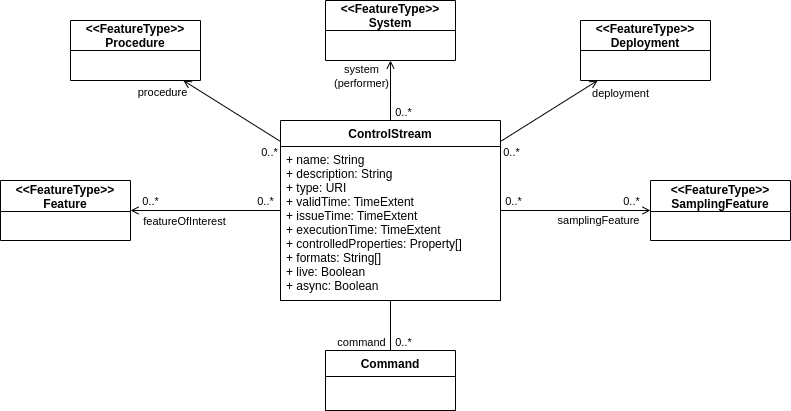
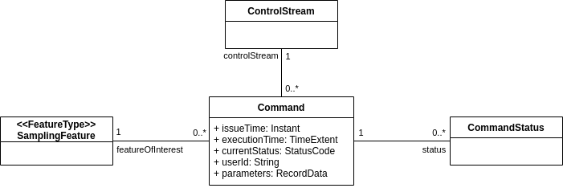
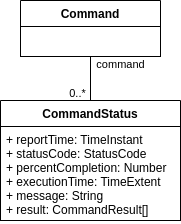

[[clause-control-resources]]
== Requirements Class "Control Streams & Commands"
include::requirements/controls/requirements_class_controls.adoc[]

=== Overview

This requirements class specifies how `ControlStream`, `Command`, and `CommandStatus` resource descriptions are provided using this API.

The `ControlStream` resource represents a control channel that is used to change the value of certain controllable properties of a feature of interest (which can be a `System`).

A `ControlStream` represents the real-time stream of command messages sent to the system, as well as all historical commands received through the channel. It can be used to provide access to real-time commands only, archived commands only, or both. The time periods that are part of the `ControlStream` resource description are used to disambiguate between these cases.

`Command` resources are available through a sub-collection of a `ControlStream` resource, and each command can lead to the creation of one or more status reports (i.e. `CommandStatus` resources).

[NOTE]
The exact way properties and associations of the resources defined in this section are represented in the payload is defined by each encoding. See section <<clause-encoding-json>> for example representations of these resources.

=== ControlStream Resources

This section defines the properties and associations (links to other resources) that apply to `ControlStream` resources.

Below is the contextual class diagram of the `ControlStream` resource:

[#datastream-class,reftext='{figure-caption} {counter:figure-num}']
.ControlStream Resource Diagram

==== Properties

[[req_controlstream-props]]
[width="90%",cols="2,6a",options="header"]
|===
^|*Requirement {counter:req-id}* |*/req/controlstream/properties*
^| A | A `ControlStream` resource SHALL include all mandatory properties listed in <<controlstream-properties>>.
|===

[#controlstream-properties,reftext='{table-caption} {counter:table-num}']
.Control Stream Properties
[width="100%",cols="4,10,3,3",options="header"]
|====
| *Name*                 | *Definition* | *Data Type* | *Usage*
| `name`                 | The human readable name of the control stream. | String | Mandatory
| `description`          | A human readable description for the control stream. | String | Optional
| `type`                 | The type of control stream (see <<controlstream-types>>). | Enum | Optional
| `validTime`            | The validity period of the control stream's description. | TimeExtent | Optional
| `issueTime`            | The time period spanned by the issue times of all commands in this datastream. | TimeExtent | Mandatory
| `executionTime`        | The time period spanned by the execution times of all commands in this datastream. | TimeExtent | Mandatory
| `controlledProperties` | Properties whose value can be changed by commands in this control stream. | List<URI> | Mandatory
| `formats`              | The list of formats that the commands in this control stream can be encoded to. | List<String> | Mandatory
|====

[[req_controlstream-type]]
[width="90%",cols="2,6a",options="header"]
|===
^|*Requirement {counter:req-id}* |*/req/controlstream/type*
^| A | A `ControlStream` resource encoding SHALL use one of the URIs provided in <<controlstream-types>> as the value of the `Type` property. +
       If using a URI is not practical, the encoding SHALL define a mapping between all possible values used to encode the type and the URIs defined in this table.
|===

[#controlstream-types,reftext='{table-caption} {counter:table-num}']
.Control Stream Types
[width="100%",cols="2,10",options="header"]
|====
| *Type*       | *Usage*
| System       | For control streams targeting the parent system itself or one of its subsystems.
| ExternalFOI  | For control streams targeting external features of interest.
|====

==== Associations

A `ControlStream` resource is also required to include the following associations:

[[req_controlstream-links]]
[width="90%",cols="2,6a",options="header"]
|===
^|*Requirement {counter:req-id}* |*/req/controlstream/links*
^| A | A `ControlStream` resource SHALL include the associations defined in <<controlstream-links>>.
|===

[#controlstream-links,reftext='{table-caption} {counter:table-num}']
.Control Stream Associations
[width="100%",cols="5,10,10",options="header"]
|====
| *Relation Name*     | *Definition* | *Target Content*
| `system`            | Link to the `System` that received commands from this `ControlStream`. | A single `System` resource.
| `commands`          | Link to the `Commands` that were sent to this control channel. | A collection of `Command` resources.
| `samplingFeatures`  | Link to the `Sampling Features` that are the target of commands in this control stream. | A collection of `SamplingFeature` resources.
| `ultimateFeaturesOfInterest`  | Link to the ultimate features of interest that are the target of commands in this control stream. | A collection of `Feature` resources.
|====

[NOTE]
The term `sampling feature` is used here to identify the proxy feature that is used to describe where the effector interacts with the feature of interest (e.g. the vent of an A/C system, the part of a larger system, etc.).

=== ControlStream Collections

Top level `ControlStream` resource collections are identified with the item-type `'controlstream'`.

[[req_controlstream-collection]]
[width="90%",cols="2,6a",options="header"]
|===
^|*Requirement {counter:req-id}* |*/req/controlstream/collection*
^|A |The server SHALL expose at least one collection containing `ControlStream` resources.
|===

[[req_controlstream-collection-type]]
[width="90%",cols="2,6a",options="header"]
|===
^|*Requirement {counter:req-id}* |*/req/controlstream/collection-type*
^|A |The server SHALL identify all collections containing `ControlStream` resources by setting the value of the `itemType` property to `'controlstream'`.
|===

[[req_controlstream-catchall-collection]]
[width="90%",cols="2,6a",options="header"]
|===
^|*Requirement {counter:req-id}* |*/req/controlstream/catchall-collection*
^|A |The server SHALL expose a collection containing all available `ControlStream` resources at URL `{api_root}/controls`.
|===

In addition to top-level collections, each system exposes its own control streams as a sub-collection.

[[req_controlstream-system-collection]]
[width="90%",cols="2,6a",options="header"]
|===
^|*Requirement {counter:req-id}* |*/req/controlstream/system-collection*
^|A | The server SHALL expose the collection of all `ControlStream` resources associated to a given `System` at URL `{systemResourceUrl}/controls`.
|===

=== Command Schema Resources

Multiple command formats can be offered for any given control stream. This API provides a way for the server to communicate the schema (_not necessarily a JSON schema_) corresponding to each command format.

Note that a different schema is needed for each individual control stream because the exact content of the command `parameters` property changes according to the properties being controlled.

[[req_controlstream-schemas]]
[width="90%",cols="2,6a",options="header"]
|===
^|*Requirement {counter:req-id}* |*/req/controlstream/schema*
^| A | The server SHALL expose the schemas for a given `ControlStream` at URL `{controlStreamResourceUrl}/schema`.
^| B | The server SHALL return a single schema corresponding to the format identified by the mandatory `cmdFormat` query parameter.
|===

.Example
=================
If a control stream reports the following supported command formats:

- `application/json`
- `application/swe+csv`
- `application/swe+binary`

The schema for each of these formats is obtained with the following requests, respectively:

- `\https://{api_root}/controls/{id}/schema?cmdFormat=application/json`
- `\https://{api_root}/controls/{id}/schema?cmdFormat=application/swe%2Bcsv`
- `\https://{api_root}/controls/{id}/schema?cmdFormat=application/swe%2Bbinary`

Note that the media type in the request has to be properly URL encoded.
=================

[NOTE]
The exact content of a schema resource is defined by each encoding. See section <<clause-encoding-json>> for example schemas used for commands encoded using the default JSON format.

=== Command Resources

`Command` resources are a generalization of the _http://www.w3.org/ns/sosa/Actuation[Actuation]_ concept defined in the <<OGC-W3C-SSN,SSN Ontology>>.

`Command` resources exposed through the API are always part of a `CommandStream`, thus they don't have to include all properties of an _Actuation_ as many of them can be factored at the command stream level.

Thus, a `Command` resource is not directly associated to an `Actuator` and a `Procedure`. Instead, it is the `CommandStream` that the command is part of, that is attached to a parent `System`. And it is the `System` that is, in turn, associated to the `Procedure` that it implements.

In addition, `Command` resources are not restricted to a single controllable property (actuable property in SSN). It is thus possible to create commands that contain several parameters, and processing a command can result in actions on several properties at once (e.g. both orientation and FOV of a camera can be modified with a single 'ptz' command).

Below is the contextual class diagram of the `Command` resource:

[#command-class,reftext='{figure-caption} {counter:figure-num}']
.Command Resource Diagram

==== Properties

[[req_command-props]]
[width="90%",cols="2,6a",options="header"]
|===
^|*Requirement {counter:req-id}* |*/req/command/properties*
^| A | A `Command` resource SHALL include all mandatory properties listed in <<command-properties>>.
|===

[#command-properties,reftext='{table-caption} {counter:table-num}']
.Command Properties
[width="100%",cols="4,10,3,3",options="header"]
|====
| *Name*               | *Definition* | *Data Type* | *Usage*
| `issueTime`          | The time the command was received by the system. | DateTime | Mandatory*
| `executionTime`      | The time period during which the command was executed. The time period ends when the effect of the command has modified all controlled properties of the feature of interest. | TimeExtent | Optional
| `currentStatus`      | Current status code of the command (see <<command-status-codes>>). | Enum | Mandatory*
| `userId`             | Identifier of the user who issued the command | String | Optional
| `parameters`         | The value of the command parameters. | Any | Mandatory
|====

(*) These properties are mandatory when a command is reported by the server but are not required when creating or updating a command. They should be ignored by the server.

[[req_command-status]]
[width="90%",cols="2,6a",options="header"]
|===
^|*Requirement {counter:req-id}* |*/req/command/status*
^| A | A `Command` resource encoding SHALL use one of the case-sensitive codes provided in <<command-status-codes>> as the value of the `Status` property. +
       If using a URI is not practical, the encoding SHALL define a mapping between all possible values used to encode the type and the URIs defined in this table.
^| B | The value of the `currentStatus` property SHALL be the same as the status code listed in the latest status report.
|===

==== Associations

A `Command` resource is also required to include the following associations:

[[req_command-links]]
[width="90%",cols="2,6a",options="header"]
|===
^|*Requirement {counter:req-id}* |*/req/command/links*
^| A | A `Command` resource SHALL include the associations defined in <<command-links>>.
|===

[#command-links,reftext='{table-caption} {counter:table-num}']
.Command Associations
[width="100%",cols="5,10,10",options="header"]
|====
| *Relation Name*     | *Definition* | *Target Content*
| `control`           | Link to the `ControlStream` that the command is part of. | A single `ControlStream` resource.
| `featureOfInterest` | Link to the feature of interest whose properties are changed by this command. | A single `SamplingFeature` resource.
| `status`            | Link to status reports related to this command. | A collection of `CommandStatus` resources.
|====

=== Command Collections

Top level `Command` resource collections are identified with the item-type `'command'`.

[[req_command-collection]]
[width="90%",cols="2,6a",options="header"]
|===
^|*Requirement {counter:req-id}* |*/req/command/collection*
^|A |The server SHALL expose at least one collection containing `Command` resources.
|===

[[req_command-collection-type]]
[width="90%",cols="2,6a",options="header"]
|===
^|*Requirement {counter:req-id}* |*/req/command/collection-type*
^|A |The server SHALL identify all collections containing `Command` resources by setting the value of the `itemType` property to `'command'`.
|===

[[req_command-catchall-collection]]
[width="90%",cols="2,6a",options="header"]
|===
^|*Requirement {counter:req-id}* |*/req/command/catchall-collection*
^|A |The server SHALL expose a collection containing all available `Command` resources at URL `{api_root}/commands`.
|===

In addition to top-level collections, each control stream exposes its own commands as a sub-collection of the `ControlStream` resource.

[[req_command-controlstream-collection]]
[width="90%",cols="2,6a",options="header"]
|===
^|*Requirement {counter:req-id}* |*/req/command/controlstream-collection*
^|A |The server SHALL expose a collection containing all `Command` resources available from a given `ControlStream` at URL `{controlStreamResourceUrl}/commands`.
|===

=== Command Status Resources

`CommandStatus` resources represent a status report describing the state of a command at a given point in time. Several status reports can be issued for any given command.

When commands are processed synchronously, a single status report is provided. But when commands are processed asynchronously, any number of status reports can be provided by the server. They are used to report early acceptance/rejection of the command, scheduling and execution steps as well as failure and cancellations.

Below is the contextual class diagram of the `CommandStatus` resource:

[#commandstatus-class,reftext='{figure-caption} {counter:figure-num}']
.Command Status Resource Diagram

==== Properties

[[req_commandstatus-props]]
[width="90%",cols="2,6a",options="header"]
|===
^|*Requirement {counter:req-id}* |*/req/commandstatus/properties*
^| A | A `CommandStatus` resource SHALL include all mandatory properties listed in <<commandstatus-properties>>.
|===

[#commandstatus-properties,reftext='{table-caption} {counter:table-num}']
.Command Status Properties
[width="100%",cols="4,10,3,3",options="header"]
|====
| *Name*                | *Definition* | *Data Type* | *Usage*
| `reportTime`          | The time when the status report was generated. | DateTime | Mandatory
| `status`              | Code describing the state of the command (see <<command-status-codes>>). | Enum | Mandatory
| `percentCompletion`   | Estimated progress as a percentage of total progress. | Number | Optional
| `executionTime`       | The time period during which the command was executed. The time period ends when the effect of the command has modified all controlled properties of the feature of interest. | TimeExtent | Optional*
| `message`             | A human readable status message. | String | Optional
|====

[[req_commandstatus-status]]
[width="90%",cols="2,6a",options="header"]
|===
^|*Requirement {counter:req-id}* |*/req/commandstatus/status*
^| A | A `CommandStatus` resource encoding SHALL use one of the case-sensitive codes provided in <<command-status-codes>> as the value of the `status` property. +
       If using a URI is not practical, the encoding SHALL define a mapping between all possible values used to encode the type and the URIs defined in this table.
^| B | The status codes SHALL be used as specified by the 'Usage' column of <<command-status-codes>>. Other properties SHALL be set as specified in the table.
|===

[#command-status-codes,reftext='{table-caption} {counter:table-num}']
.Command Status Codes
[width="100%",cols="2,10",options="header"]
|====
| *Code*      | *Usage*
| PENDING     | The command is pending, meaning it has been received by the system but no decision to accept or reject it has been made.
| ACCEPTED    | The command was accepted by the receiving system. This usually means that the command has passed the first validation steps, but it can still be rejected or fail later during execution.
| REJECTED    | The command was rejected by the receiving system. It won't be executed at all and the `message` property provides the reason for the rejection. This is a final state. No further status updates will be sent.
| SCHEDULED   | The command was validated and effectively scheduled by the receiving system. When this status code is used, the scheduled execution time must be provided.
| UPDATED     | An update to the command was received and accepted. This code must be used if the system supports task updates.
| CANCELED    | The command was canceled by an authorized user. This code must be used if the system supports user driven task cancellations. The `REJECTED` state should be used instead if the command was canceled by the receiving system. This is a final state. No further status updates will be sent.
| EXECUTING   | The command is currently being executed by the receiving system. The status message can provide more information about the current progress. A system can send several status updates with this code but different time stamps to report progress incrementally. In particular, the progress percentage and the end of the (estimated) execution time period can be refined in each update.
| COMPLETED   | The command has completed after a successful execution. The actual execution time must be provided. This is a final state. No further status updates will be sent.
| FAILED      | The command has failed during execution. The error and/or status message provides the reason for failure. This is a final state. No further status updates will be sent.
|====

==== Associations

A `CommandStatus` resource is also required to include the following associations:

[[req_commandstatus-links]]
[width="90%",cols="2,6a",options="header"]
|===
^|*Requirement {counter:req-id}* |*/req/commandstatus/links*
^| A | A `CommandStatus` resource SHALL include the associations defined in <<commandstatus-links>>.
|===

[#commandstatus-links,reftext='{table-caption} {counter:table-num}']
.Command Status Associations
[width="100%",cols="5,10,10",options="header"]
|====
| *Relation Name*     | *Definition* | *Target Content*
| `command`            | Link to the `Command` that this status report relates to. | A single `Command` resource.
|====